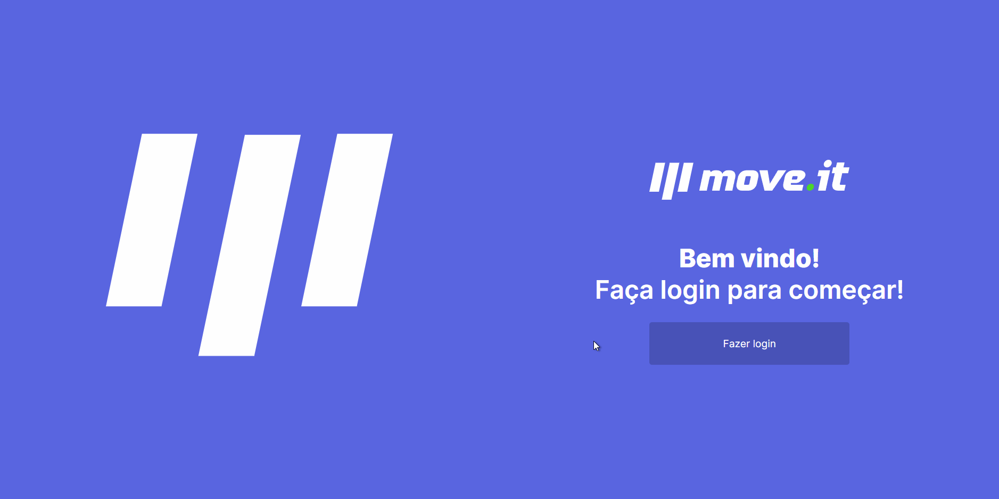
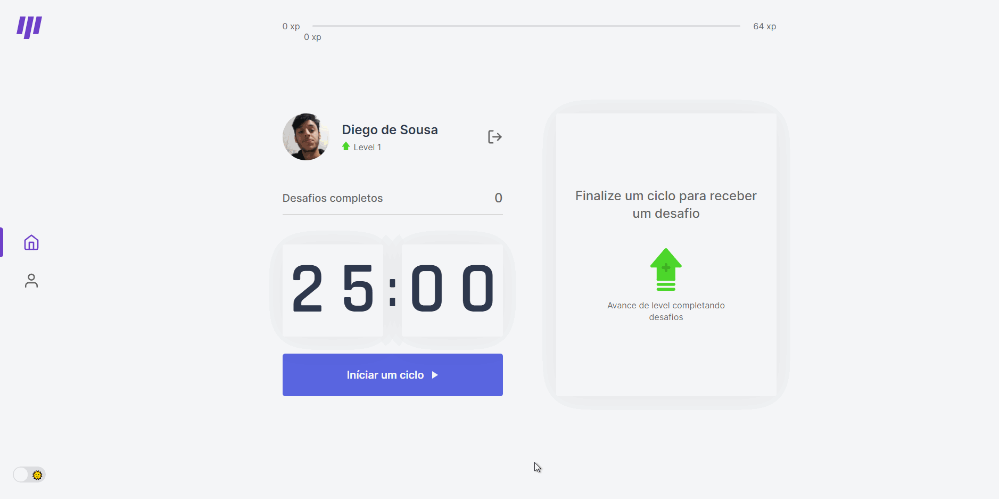
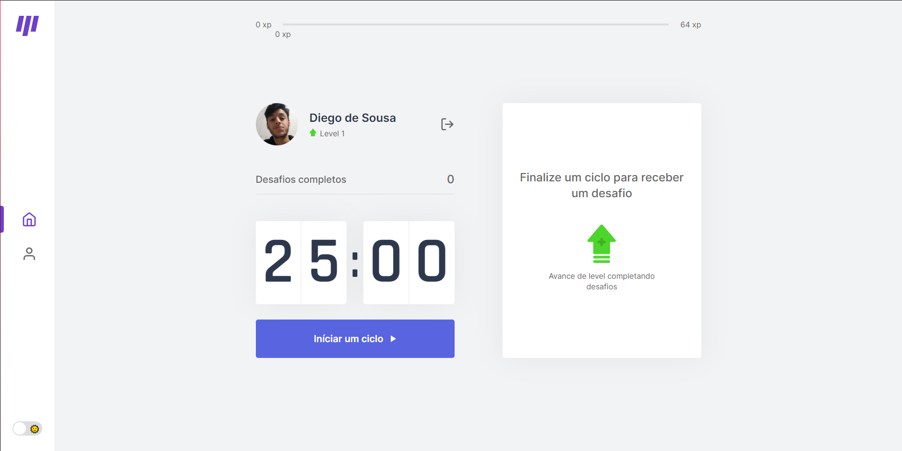
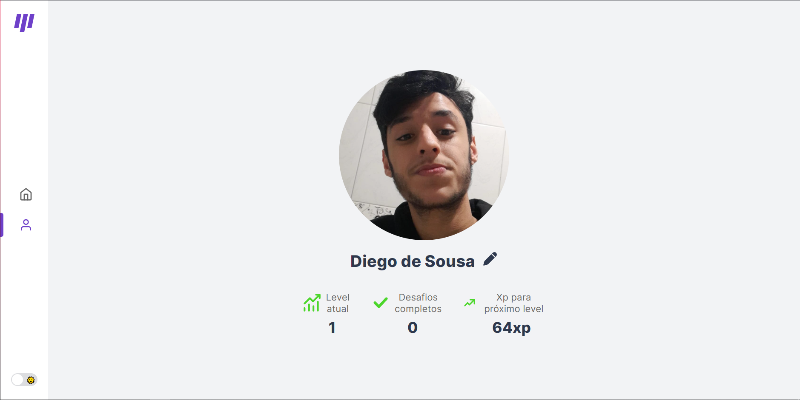
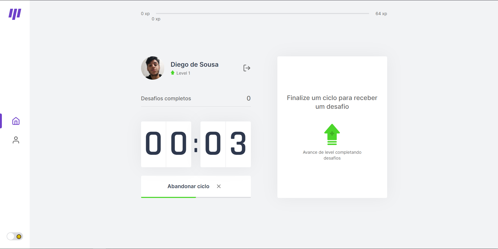
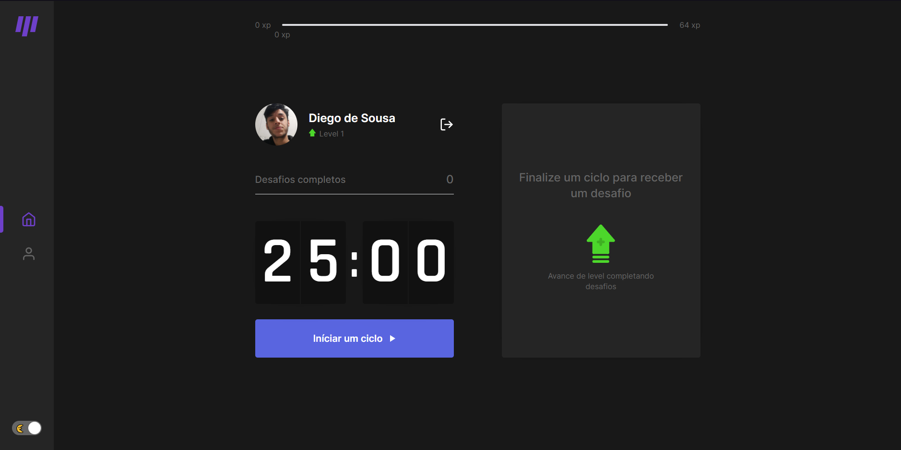
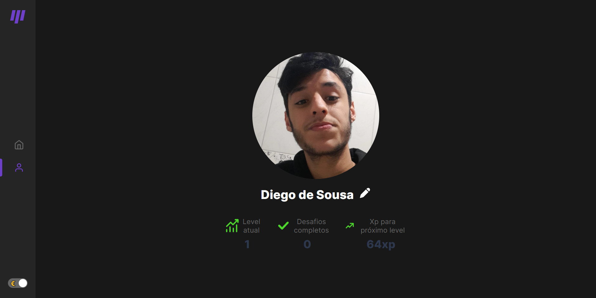
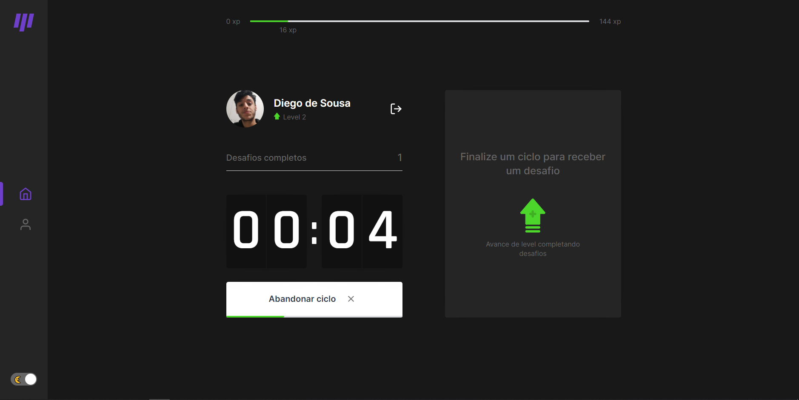
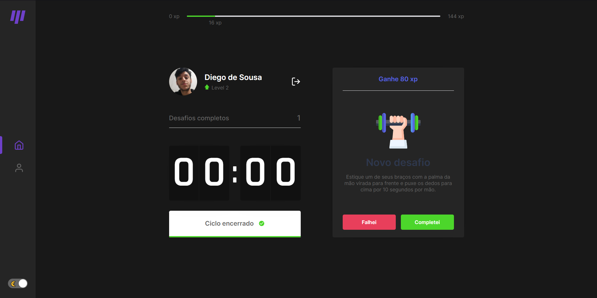

<p align="center">
    
    <p align="center">O move.it busca ajudar quem fica por muito tempo no computador a se exercitar, através do
    modo pomodoro. Recupere seu foco e atenção para continuar o seu trabalho com o move-it 🏃🏻🚀</p>
</p>

<h1 align="center">📌 Tabela de conteúdos<h2>
<p align="center">
    <a href="#computer-projeto">• Projeto</a>
    <a href="#camera-demonstração">• Demonstração</a>
    <a href="#hammer_and_wrench-tecnologias">• Tecnologias</a>
    <a href="#link-pré-requisitos">• Pré-Requisitos</a>
    <a href="#technologist-instalação">• Instalação</a>
</p>

<h4 align="center"> 
	✅  Move.It 🚀 Finalizado  ✅
</h4>

## :computer: **Projeto**
O move.it é um projeto desenvolvido com React Js e Next Js, durante a Next Level Week #4 da <a href="https://www.rocketseat.com.br">Rocketseat</a>. Além de todo o conteúdo aprendido no evento, esse Web App também carrega alguns de meus conhecimentos em React Js :wink: !

## :camera: **Demonstração**

<p align="center">
    
    
</p>

#### Tema claro
<p align="center">
    
    
    
    
</p>

#### Tema escuro
<p align="center">
    
    
    
    
</p>

## :hammer_and_wrench: **Tecnologias**
- **[TypeScript](https://www.typescriptlang.org/)**
- **[NextJS](https://nextjs.org/)**
- **[Iconify](https://iconify.design)**
- **[JsCookie](https://github.com/js-cookie/js-cookie)**

## :link: **Pré-Requisitos**
Antes de começar, é necessário ter o <a href="https://nodejs.org/pt-br">Node Js</a> instalado em sua máquina, além disso, é interessante ter um bom editor de código para trabalhar, como o <a href="https://code.visualstudio.com/Download">VSCODE</a>.

## :technologist: **Instalação**
1. Clonar repositório
2. Abrir o VSCODE com o repositório
3. Abrir o terminal do VSCODE ou abrir o cmd dentro do repositório
4. Execute os comandos abaixo
```sh
# Instalar todas as dependências do projeto
yarn install
```
```sh
# Executar a aplicação em modo de desenvolvimento
yarn dev
```
5. Abra o servidor local(localhost) exibido no terminal

Todos os tipos de contribuições são muito bem-vindos e apreciados!
- ⭐️ Favoritar o projeto!
- 🐛 Encontrar e relatar problemas!

Feito por DiegoSousa-11 👋 <a href="https://www.linkedin.com/in/diego-sousa-28003b209/">Entre em contato!</a>
